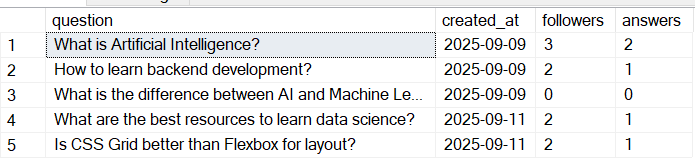

# Quora – Database Project

This project is a simplified simulation of Quora's core features, focusing purely on the **database layer**.  
It focuses on simulating the essential backend logic — including user interactions, question-and-answer flows, and topic-based content delivery — through stored procedures and functions in SQL Server.

---

## Project Overview

This project provides a SQL Server-based backend that mimics the main functionality of the Quora platform, including:

- Users posting questions and answers
- Following topics and users
- Viewing answers on a homepage feed
- Interacting via upvotes, downvotes, comments, and shares

---

## Use Cases

1. **User Homepage Feed** – Shows answers to questions related to the topics a user follows  
2. **Comments Section** – Displays all comments under a specific answer  
3. **User Profile** – Shows user stats: number of answers, questions, followers, and followed topics  
4. **Recommended Questions** – Based on the topics the user follows  
5. **User’s Questions & Answers** – Allows users to track their content and interactions  
6. **Answers to My Questions** – Helps users see who answered their questions  
7. **Topic & Space Following** – Displays topics and spaces followed by a user  

---

## Project Structure

| File / Folder          | Description                                           |
|------------------------|-------------------------------------------------------|
| `main_queries.sql`     | All stored procedures and variable usage              |
| `stored_procedures.sql`| Execution and testing of procedures                   |
| `functions.sql`        | Scalar functions used across procedures               |
| `schema.sql`           |Table structure definitions and initial data population|
| `images/`              | Screenshots of query results and UI                   |

---

## Sample Output Screenshots

### ✅ Query Result - Homepage Feed

---

### ✅ Query Result - Questions For You

---

## UI Preview (Homepage Design)

This is a preview of the homepage used in this Quora Lite simulation.

---

##  How to Use
1. Restore or connect to your SQL Server database.  
2. Run the scripts in the following order:  
   - `schema.sql` (to create tables and insert initial data)  
   - `functions.sql` (to create scalar functions)  
   - `stored_procedures.sql` (to define stored procedures)  
   - `main_queries.sql` (to run queries using the stored procedures and functions)  
3. Use **SQL Server Management Studio (SSMS)** to run and test the procedures and queries.  
4. Images are included in the `images/` folder for reference.  

